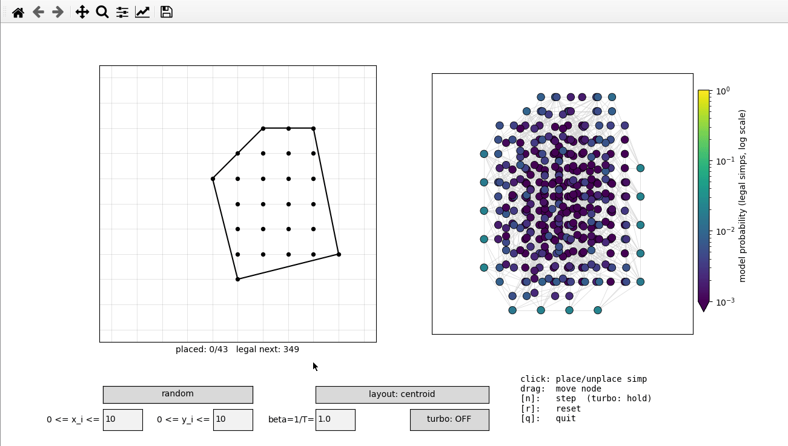
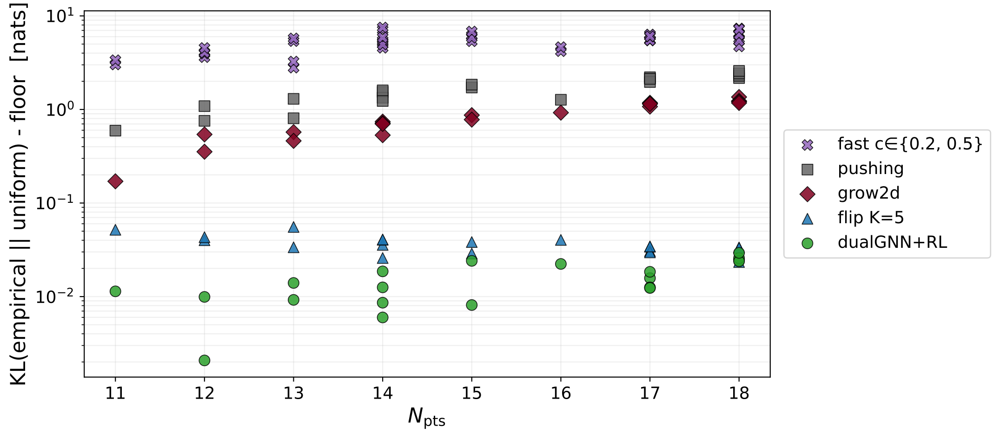
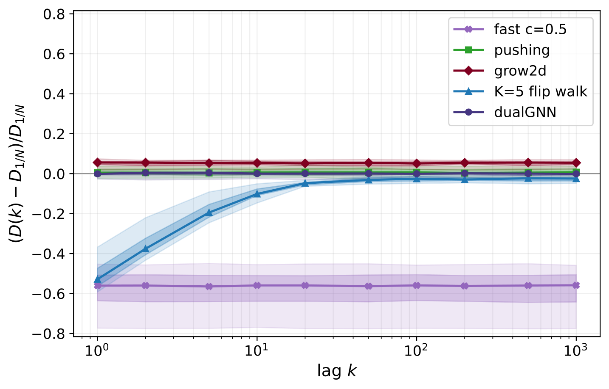
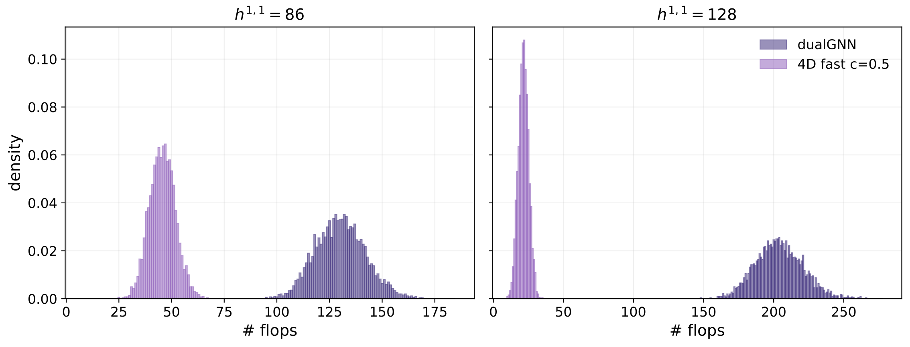

# dualGNN
*[Nate MacFadden](https://github.com/natemacfadden), Liam McAllister Group, Cornell*

**Paper:** [Sampling Triangulations and Calabi-Yau Threefolds with Autoregressive GNNs](https://arxiv.org/abs/2605.27770) (arXiv:2605.27770; [PDF in this repo](paper.pdf))

[](https://doi.org/10.5281/zenodo.20622920)

<p align="center"></p>

This repo contains a small **graph-neural-network** sampler for **fine regular triangulations** (FRTs) of convex 2D lattice polygons.

These [FRTs are useful in string theory](https://arxiv.org/abs/2309.10855). More generally, they are a combinatorial population to sample from with nontrivial local and global constraints. At the time of writing this, the 'dualGNN' model in this repo is the most uniform sampler tested for polygons up to $\sim10^{20}$ triangulations.

## Model

The idea is to represent a triangulation $\mathcal{T}_i$ by its [dual graph](https://en.wikipedia.org/wiki/Dual_graph): nodes are simplices $\sigma_a\in\mathcal{T}_i$ and edges are drawn between adjacent simplices. By combining into $G$ the dual graphs of all fine triangulations (if the same simplex $\sigma_a$ is in another triangulation $\mathcal{T}_j$, merge the nodes), one can view the problem as selecting an appropriate subgraph from $G$. We do so autoregressively, adding simplices 1-by-1 to the subgraph through
1) having the model assign probabilities to the nodes (via message passing),
2) sampling a node according to these probabilities, and then
3) masking out nodes which cannot coexist with the newly chosen simplex.

To give the model enough information to do this, we encode the polytope's 'oriented matroid' via certain vectors corresponding to 'signed circuits' (see [page 17 here](https://imag.umontpellier.fr/~ramirez/LectureSL6.pdf) or [this wonderful book](https://link.springer.com/book/10.1007/978-3-642-12971-1)). The matroid characterizes the count of fine triangulations while our specific vectors (slightly richer than actual circuits) characterize the regularity of these triangulations ([DRS](https://link.springer.com/book/10.1007/978-3-642-12971-1)). More so, circuits are invariant under the $\mathrm{GL}_N(\mathbb{Z})\ltimes\mathbb{Z}^N$ symmetries of the polytope (we weaken to $\mathrm{SL}_N(\mathbb{Z})\ltimes\mathbb{Z}^N$ - see paper), giving the model strong inductive bias. This information is specifically encoded on the edges of $G$ and is concatenated with the messages passed through said edges.

This model is trained via supervised learning on a pool of fine regular triangulations. We allow bootstrapping of the pool (similar to [CYTransformer](https://arxiv.org/abs/2507.03732)) since the polygons of primary interest have too many triangulations to enumerate (otherwise, enumerating them and sampling from them would be preferable). We also fine-tune with REINFORCE.

## Performance

The model
1) is the most uniform sampler of FRTs tested (there are a few methods due to their application in string theory; we include some custom methods, too),
2) is general (a single model can be trained that samples FRTs from arbitrary polygons),
3) is small (~92k parameters; trained in ~7.5hrs; checkpoint attached to this repo),
4) shows good inductive bias (generalizes zero shot), and
5) is competitive in speed compared to the other tested samplers.

Most of the performance is attributed to the inductive bias. See the paper.

The major limitations are that this model was trained with $K=16$ message passing rounds - if the polygon of interest has $\mathrm{diam}(G)\gtrsim K$ then performance is expected to degrade. Additionally, while dualGNN enhances the sampling of *regular* triangulations generally, it does not only sample regular triangulations (irregulars sneak in). Neither issue inhibits use in practice - most polygons of interest have much smaller diameters and regularity is typically so prevalent that filtering on it is a good strategy.

For string theory applications, it generates uniform samples (when paired with my [NTFE algorithm](https://arxiv.org/abs/2309.10855)) up to $h^{1,1}=86$. Likely higher (we generated samples consistent with being uniform at $h^{1,1}=128$, but it's hard to gain enough confidence in uniformity here). The model runs all the way up to the max $h^{1,1}=491$, but checking uniformity here would require assessing it out of a pool of [at least](https://arxiv.org/abs/2602.16909) $10^{167}$, which our statistics definitely cannot do. Also, we'd likely need more message passing rounds ($K=16$ in attached model).

## Results

The figures below are taken **from [the paper](paper.pdf)** (included in this repo) and are
**not directly reproducible from the code here**; the repo ships inference and a small
uniformity demo (`uniformity/`), not the full training and evaluation pipeline. See the
paper for methodology, hardware, and sample counts.

**Zero-shot to a much larger polygon.** The model, trained on the single triangle
$\mathrm{conv}\{(0,0),(0,4),(6,0)\}$ ($405{,}706$ FRTs) and applied zero-shot to $[0,4]^2$
($735{,}430{,}548$ FRTs), reaches the uniform ($1/N$) floor and is faster than `flip_walk`,
the only other sampler that reaches it; `pushing`/`grow2d`/`fast` are quicker but biased.

![KL vs sample time, zero-shot on [0,4]^2](figures/fig10_zeroshot_pareto.png)

**Most uniform across many polygons.** Over $200{,}000$ samples on $20$ held-out polygons
($11 \le N_\mathrm{pts} \le 18$), dualGNN is the most uniform sampler tested at every size,
tying `flip_walk` only at $N_\mathrm{pts}=18$ while being $\sim4\times$ faster.



**No sample autocorrelation.** A good sampler's draws should be as far apart as independent
uniform draws. Plotting the flip distance between samples $k$ apart, normalized against that
uniform baseline, dualGNN matches uniform ($0$) at every lag while `flip_walk`'s nearby
samples are correlated (closer together) until about $k=20$.



**Downstream: more diverse Calabi-Yau samples.** Combined into Calabi-Yau threefolds via the
[NTFE algorithm](https://arxiv.org/abs/2309.10855), dualGNN's samples span far wider flop
distances than the de facto `random_triangulations_fast` ($130$ vs $46$ mean flops at
$h^{1,1}=86$; $204$ vs $22$ at $h^{1,1}=128$), a tradeoff for its uniformity.



## Install

Recommended
```
conda env create -f environment.yml
conda activate dualgnn
```

For inference only, you can instead `pip install -e .` into an existing environment; everything it needs is on PyPI, and the model checkpoints ship inside the package. By default this pulls the standard PyTorch build, which on Linux bundles CUDA (a multi-GB download). On a CPU-only or Apple-silicon machine, install the matching wheel first (e.g. `pip install torch --index-url https://download.pytorch.org/whl/cpu`) then `pip install -e .`. The tutorials' plotting and the GUI additionally need matplotlib (`pip install -e .[viz]`). Training is conda-only because it needs CYTools, so `pip install -e .[train]` fails on purpose and points you back to the conda env above.

## Inference

One call samples deduplicated fine triangulations of a polygon with the
shipped model (packaged as data -- works from any install, CPU included):

```python
import numpy as np
from dualgnn import sample_frts

pts = np.array([[x, y] for x in range(5) for y in range(5)], dtype=np.int64)  # [0,4]^2
fts = sample_frts(pts, 8)                              # (<=8, 32, 3) int8
fts = sample_frts(pts, 8, only_regular=True, seed=0)   # FRTs only
```

The lower-level pieces are available too -- `DualGNN.default()` is the
shipped REINFORCE-finetuned model (cached per device), `DualGraph` the
candidate complex, and `sample` the raw with-replacement sampler:

```python
from dualgnn       import DualGraph, sample
from dualgnn.model import DualGNN

net = DualGNN.default()                  # or DualGNN.from_ckpt(path)
fts = sample(net, DualGraph(pts), Ntriangs=8)          # (8, 32, 3) int8
```

**Stable contract** (downstream consumers, e.g. CYTools, rely on this):
`pts` is the polygon's full lattice-point set as an `(Npts, 2)` int array,
and returned simplices index into `pts` in the caller's row order. Every
sample is a fine triangulation of the full point set, returned in canonical
form (vertex indices sorted within each simp, simps lex-sorted), so exact
duplicates compare equal under `np.unique(axis=0)`. Regularity is learned,
not guaranteed -- filter with `only_regular=True` (or your own check) if
you need FRTs.

See `tutorials/inference_demo.ipynb` for a runnable version with plotting.

For comparison, two reference samplers are bundled (CYTools-free, both
return `(simps, status)`):

```python
from dualgnn import grow2d, pushing

simps, status = grow2d(pts, seed=0)    # random fine triangulation
simps, status = pushing(pts, seed=0)   # random fine pushing triangulation
```

### GUI

For fun, we include a GUI demo (it's what's shown at the top of this README): `python scripts/visualize.py`. It allows you to build an arbitrary (or random) lattice polytope (left), build its graph $G$ (right), and either select nodes manually (clicking) or randomly (n-button). This is the same model trained and studied in the paper. It should run even on light hardware... I tested it on my M1 MacBook.

### String Theory

Pair the 2D sampler with the [NTFE algorithm](https://arxiv.org/abs/2309.10855)
to sample fine, regular, star triangulations (FRSTs) of a reflexive 4D polytope:

```python
import numpy as np
from cytools import Polytope
from dualgnn.model import DualGNN
from dualgnn.ntfe  import sample_ntfes

verts = [[-1, -1, -1, -1], [-1, -1, -1,  3], [-1, -1,  3, -1], [-1,  3, -1, -1],
         [ 1, -1, -1, -1], [ 1, -1, -1,  3], [ 1, -1,  3, -1], [ 1,  3, -1, -1]]
poly = Polytope(np.array(verts, dtype=np.int64))                           # reflexive, h11 = 86
net  = DualGNN.default()
heights = sample_ntfes(poly, net, N=20, N_face_triangs=1_000, n_workers=4) # (20, npts) float64
```

Each row is a height vector defining an FRST; pass `as_triangs=True` to get
CYTools `Triangulation` objects instead. See `tutorials/ntfe_demo.ipynb`.

## Train end-to-end

> **Requires the conda environment** (`environment.yml`) -- these scripts import CYTools, which pip cannot provide.

Three commands -- generate polygons, supervised train, REINFORCE fine-tune:

```
# 1) sample polygons (Npts 5..40, 3 per bucket); writes polygons.parquet
python scripts/make_polygons.py --out runs/data/polygons.parquet

# 2) supervised train (~5 h on a Blackwell-class GPU at 500k steps)
python scripts/train.py \
    --run-dir runs/sft \
    --src-polygons runs/data/polygons.parquet \
    --src-fts-dir  runs/data/fts \
    --n-steps 500000

# 3) REINFORCE fine-tune from the SFT final ckpt (~2 h at 10k steps)
python scripts/reinforce.py \
    --init-ckpt runs/sft/ckpt_0500000.pt \
    --run-path  runs/rl \
    --steps 10000
```

The FRT pool is auto-harvested per polygon on first use; you can also
pre-harvest a specific polygon via `python scripts/harvest.py --poly-id N`.

## Citation

If you use `dualGNN`, please cite [Sampling Triangulations and Calabi-Yau
Threefolds with Autoregressive GNNs](https://arxiv.org/abs/2605.27770):

```bibtex
@article{MacFadden:2605.27770,
  author  = {MacFadden, Nate},
  title   = {Sampling Triangulations and Calabi-{Y}au Threefolds with Autoregressive {GNN}s},
  doi     = {10.48550/arXiv.2605.27770},
  url     = {https://arxiv.org/abs/2605.27770},
}
```

and/or this repository:

```bibtex
@software{dualGNN,
  author  = {MacFadden, Nate},
  title   = {dualGNN},
  doi     = {10.5281/zenodo.20622920},
  url     = {https://github.com/natemacfadden/dualGNN},
  orcid   = {0000-0002-8481-3724},
}
```

## Layout

```
src/dualgnn/          library code (DualGraph, DualGNN, sampler, training)
src/dualgnn/ckpts/    shipped checkpoints, packaged as data (D32K16 SFT,
                      D32K16 + REINFORCE = DualGNN.default())
scripts/              CLI entry points (train, reinforce, harvest, make_polygons, visualize)
tutorials/             inference, NTFE demos
```
